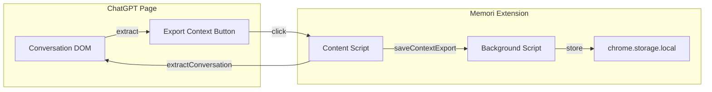

# Context Export Feature - Implementation Plan

## Overview

Allow users to export the full context of their current ChatGPT conversation into a compact, portable form with one click. Step 1: Store the exported context in Memori's memory.

## User Story

> "I have a long chat in ChatGPT, but I didn't get what I wanted. I want to export the context of the current chat to use elsewhere (e.g., Claude) with a single button click. First, store it in memory."

---

## Architecture



---

## Step 1: Store Context in Memory

### 1.1 Extract Conversation from ChatGPT DOM

**Challenge**: ChatGPT's DOM structure may change. We need robust selectors.

**Approach**:
- Find all message elements using `[data-message-author-role="user"]` and `[data-message-author-role="assistant"]`
- ChatGPT typically renders messages in a scrollable container; messages may be in `article` elements or divs with role attributes
- Fallback: Look for `[class*="message"]` or `[class*="Message"]` containers
- Extract text via `innerText` or `textContent` (avoid code blocks, buttons, etc.)

**Selectors to try** (in order):
1. `[data-message-author-role="user"]` - user messages
2. `[data-message-author-role="assistant"]` - assistant messages  
3. `article` or `[role="article"]` - message containers (ChatGPT uses these)
4. `[class*="markdown"]` or message content wrappers

**Extraction logic**:
- Query all message containers in document order (preserves chronology)
- For each: determine role (user vs assistant), extract visible text
- Build array: `[{ role: 'user'|'assistant', content: string }]`

### 1.2 Compact Format

**Options for "compact form"**:
- **Option A**: Markdown-style with clear role labels
  ```
  ## User
  [message 1]
  
  ## Assistant  
  [response 1]
  
  ## User
  [message 2]
  ...
  ```
- **Option B**: Simple prefix format (minimal tokens)
  ```
  User: [message 1]
  Assistant: [response 1]
  User: [message 2]
  ...
  ```
- **Option C**: JSON (structured but verbose)

**Recommendation**: Option B for maximum portability and token efficiency when pasting into Claude.

### 1.3 Storage Schema

**New storage key**: `memori_context_exports`

**Structure**:
```javascript
{
  memori_context_exports: [
    {
      id: "ctx_abc123",
      timestamp: 1739567890123,
      messageCount: 12,
      compactText: "User: ...\nAssistant: ...",  // The portable format
      messages: [{ role: "user", content: "..." }, ...]  // Optional: structured backup
    }
  ]
}
```

**Constraints**:
- Store last N exports (e.g., 10) to avoid unbounded growth
- Each export is a single "context snapshot" - not mixed with regular memories

### 1.4 UI: Export Button

**Placement options**:
1. **In sidebar** - New "Export Context" button in the Memories tab header or as a prominent action
2. **Floating button** - Near the existing "Save to memory" button (e.g., "Export context")
3. **Both** - Button in sidebar when open, and a floating/secondary button

**Recommendation**: Add to sidebar in the Memories tab - a clear "Export chat context" button that appears when the sidebar is open. Optionally add a small floating button for quick access.

**Flow**:
1. User clicks "Export chat context"
2. Content script extracts all visible messages from the current chat
3. Formats into compact form
4. Sends to background: `saveContextExport({ compactText, messages })`
5. Background stores in `memori_context_exports`
6. Show feedback: "Context exported! (12 messages)"

---

## Implementation Phases

### Phase 1: Extraction + Storage (Step 1)
1. Add `extractChatContext()` in contentScript.js - DOM traversal to get all user/assistant messages in order
2. Add `formatContextCompact(messages)` - convert to "User: ...\nAssistant: ..." format
3. Add `saveContextExport` action in background.js + storage logic
4. Add "Export context" button in sidebar (Memories tab)
5. Wire up click handler → extract → format → save → feedback

### Phase 2: View & Inject (Future)
- List context exports in sidebar (new section or tab)
- "Inject" button to paste a context export into ChatGPT input (or copy to clipboard for use in Claude)

### Phase 3: External Export (Future)
- Copy to clipboard
- Open Claude with pre-filled context (if possible via URL/API)

---

## File Changes (Phase 1)

| File | Changes |
|------|---------|
| `contentScript.js` | Add `extractChatContext()`, `formatContextCompact()`, Export button in sidebar, click handler |
| `background.js` | Add `CONTEXT_EXPORTS_KEY`, `saveContextExport()`, `getContextExports()`, message handler |
| `manifest.json` | No changes needed |

---

## Edge Cases

- **Empty chat**: Disable button or show "No messages to export"
- **Very long chat**: ChatGPT may virtualize/lazy-load messages. We can only extract what's in the DOM. Consider scrolling to load more (complex) or document limitation.
- **Streaming response**: If assistant is still typing, include partial response
- **DOM changes**: ChatGPT updates their UI frequently. Use multiple fallback selectors; may need maintenance.

---

## Testing Checklist

- [ ] Export from chat with 2-3 exchanges
- [ ] Export from long chat (10+ messages)
- [ ] Verify compact format is readable
- [ ] Verify storage persists across page reload
- [ ] Empty chat shows appropriate message
